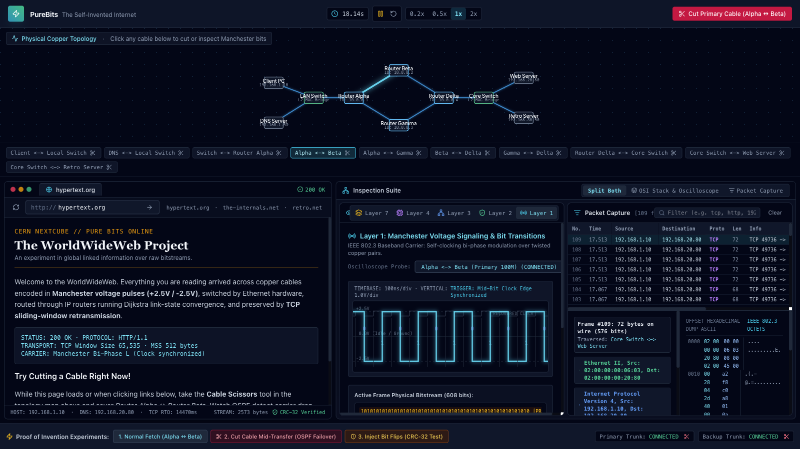

# From Bits to the Web

A small internet simulated in the browser, from Manchester-coded bits on copper up to an HTTP page load. Every protocol in it is written from scratch, and you can cut cables or add noise while a page is loading.

**Live demo:** https://neurabytelabs.github.io/bits-to-web/



## What it does

- Simulates a client, a DNS server, two switches, four routers and two web servers connected by cables.
- When you open a URL in the built-in browser, the client sends a DNS query over UDP, opens a TCP connection to the returned address, sends an HTTP GET and renders the HTML that comes back.
- Every frame is turned into bits, Manchester-encoded and moved along the cable bit by bit. You can watch the bits travel on the topology map and the voltage trace on an oscilloscope.
- A packet capture view decodes each frame layer by layer (Ethernet, IPv4, UDP or TCP, DNS or HTTP) and shows its hex dump, much like Wireshark.
- Three experiments: a normal page load, cutting the primary router link (routing switches to the backup path), and a noisy cable that flips bits (frames fail the CRC-32 check and TCP retransmits them).

## How it works

Each layer is a module in `src/simulation/`:

- **Physical** (`physical.ts`, `manchester.ts`): adds the 7-byte preamble and start-of-frame delimiter, encodes each bit as a voltage transition, moves bits along a cable over simulated time, and drops everything in flight when a cable is cut. A noisy cable flips bits at random.
- **Data link** (`ethernet.ts`, `crc32.ts`): Ethernet II frames with a CRC-32 frame check sequence. Switches learn source MAC addresses per port and flood frames for unknown destinations.
- **Network** (`ip.ts`, `ospf.ts`, `arp.ts`): IPv4 packets with header checksum and TTL. Whenever a link goes up or down, every router receives the updated link-state database, runs Dijkstra's shortest-path algorithm, and rebuilds its forwarding table. Packets are forwarded by longest-prefix match. ARP tables are pre-filled.
- **Transport** (`tcp.ts`, plus the connection logic in `networkEngine.ts`): three-way handshake, sequence and acknowledgement numbers, in-order delivery with a receive buffer, and retransmission with an adaptive timeout (smoothed RTT, Karn's rule, exponential backoff).
- **Application** (`dns.ts`, `http.ts`): DNS A-record queries over UDP port 53, and HTTP/1.1 requests and responses split into 512-byte TCP segments.

`networkEngine.ts` ties the layers together. On every animation frame it advances the cables, reassembles the bits that arrive at each interface into frames, checks their CRC, and hands them to the switch, router or host logic.

## Run locally

Requires Node.js 20.19 or newer.

```bash
npm install
npm run dev      # http://localhost:3000
npm run build    # static site in dist/
npm run lint     # type check
```

## Status

Prototype. It runs in current desktop browsers; the layout is not designed for phones. Time is slowed down so you can follow single frames: one page load takes about 15 seconds at 1x speed. ARP resolution is not simulated, and there are no automated tests yet.

## License

MIT. See [LICENSE](LICENSE).
